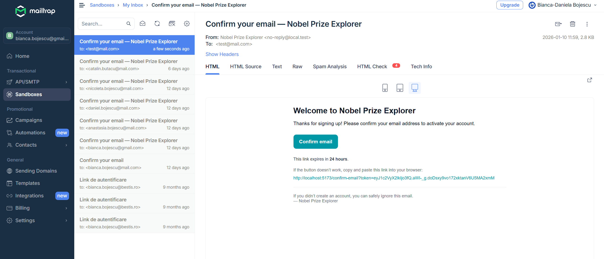
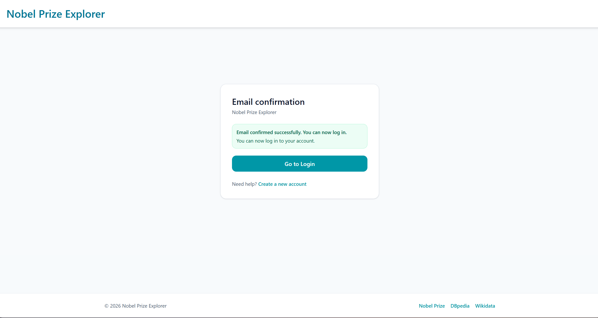

<div align="center">
  <h1>Nobel Prize Explorer</h1>
  
  <p>
    A responsive Nobel Prize exploration platform powered by SPARQL and enriched with DBpedia/Wikidata, featuring plug-in statistics and a REST/GraphQL API.
  </p>

<!-- Badges -->
<p>
  <a href="https://github.com/olarubianca6/NobelExp/forks">
    
  </a>
  <a href="https://github.com/olarubianca6/NobelExp/issues">
    
  </a>
</p>
   
<h4>
    <a href="https://github.com/olarubianca6/NobelExp">Documentation</a>
  <span> · </span>
    <a href="https://github.com/olarubianca6/NobelExp/issues">Report Bug</a>
  <span> · </span>
    <a href="https://github.com/olarubianca6/NobelExp/issues">Request Feature</a>
  </h4>
</div>

<br />

<!-- Table of Contents -->
# :notebook_with_decorative_cover: Table of Contents

- [About the Project](#star2-about-the-project)
  * [Screenshots](#camera-screenshots)
  * [Tech Stack](#space_invader-tech-stack)
  * [Features](#dart-features)
  * [Environment Variables](#key-environment-variables)
- [Getting Started](#toolbox-getting-started)
  * [Prerequisites](#bangbang-prerequisites)
  * [Installation](#gear-installation)
  * [Run Locally](#running-run-locally)
  * [Deployment](#triangular_flag_on_post-deployment)
- [Usage](#eyes-usage)
- [Roadmap](#compass-roadmap)
- [Contact](#handshake-contact)


  

<!-- About the Project -->
## :star2: About the Project
  <p>
    Using the SPARQL endpoint provided by the Nobel Prize organization, together with additional knowledge aggregated from DBpedia and Wikidata, we developed a modular, responsive web system that presents rich information about Nobel prizes, laureates, and institutions across selected domains, time periods, and other user-defined filters. The platform also exposes relevant relationships between entities (e.g., links between laureates, institutions, prizes, and associated topics). In addition, by adopting a plug-in-based architecture, the system provides a range of statistics about Nobel awards—such as recipient demographics (age, gender, background), category-level insights (chemistry, physics, physiology or medicine, etc.), geographic distribution, university-related indicators, and analyses of awardees’ collaborations and accomplishments. The solution includes a dedicated SPARQL endpoint and a REST/GraphQL API layer that delivers requested data efficiently through asynchronous processing.
  </p>


<!-- TechStack -->
### :space_invader: Tech Stack

<details>
  <summary>Client</summary>
  <ul>
    <li><a href="https://developer.mozilla.org/en-US/docs/Web/JavaScript">JavaScript</a></li>
    <li><a href="https://react.dev/">React</a></li>
    <li><a href="https://tailwindcss.com/">Tailwind CSS</a></li>
    <li><a href="https://zustand-demo.pmnd.rs/">Zustand</a></li>
  </ul>
</details>

<details>
  <summary>Server</summary>
  <ul>
    <li><a href="https://www.python.org/">Python</a></li>
    <li><a href="https://flask.palletsprojects.com/">Flask</a></li>
    <li><a href="https://flask-login.readthedocs.io/">Flask-Login</a></li>
    <li><a href="https://data.nobelprize.org/sparql">Nobel Prize SPARQL Endpoint</a></li>
    <li><a href="https://mailtrap.io/">Mailtrap</a> (email testing)</li>
  </ul>
</details>

<details>
<summary>Database</summary>
  <ul>
    <li><a href="https://www.sqlite.org/">SQLite</a></li>
  </ul>
</details>

<!-- Features -->
### :dart: Features

- **SPARQL-powered Nobel explorer:** Browse Nobel prizes and laureates using the Nobel Prize SPARQL endpoint, with responsive UI, category/year filtering, and paginated results.
- **Entity details + relationships:** Dedicated pages/cards for prizes and people, showing linked relations between laureates, prizes and categories (with RDF/SPARQL-based data integration).
- **Statistics & insights:** A statistics area (plug-in friendly) that aggregates interesting metrics about Nobel awards (e.g., distributions by category, time period, geography, and recipient demographics where available).


<!-- Env Variables -->
### :key: Environment Variables

To run this project, create a `.env` file based on the provided `.env.example` and fill in the required values.


<!-- Getting Started -->
## :toolbox: Getting Started

<!-- Prerequisites -->
### :bangbang: Prerequisites

- Node.js (LTS) and npm installed

<!-- Installation -->
### :gear: Installation

Clone the project

```bash
git clone https://github.com/olarubianca6/NobelExp.git
````

Go to the project directory

```bash
cd NobelExp
```

Install dependencies

```bash
npm install
```

<!-- Run Locally -->

### :running: Run Locally

Start the client (frontend)

```bash
npm run dev
```

Start the server (backend) in a separate terminal (if applicable)

```bash
npm run server
```

<!-- Deployment -->

### :triangular_flag_on_post: Deployment

```bash
npm run build
npm run start
```


<!-- Usage -->
## :eyes: Usage

**Create account (Register page)**  
A clean, responsive registration screen where users can create an account by providing an email address and a password.


**Registration success → Email confirmation → Login**  
After submitting the registration form, the app confirms the account was created and instructs the user to verify their email. A confirmation email is delivered to **Mailtrap** (testing inbox). After clicking **Confirm email**, the user is redirected back to the app where the email confirmation success message is displayed. The user can then log in using the **same email and password** used during registration.

> **Confirmation message shown in-app:** “Email confirmed successfully. You can now log in.”


<table>
  <tr>
    <td width="50%">
      <p><b>Mailtrap confirmation email</b></p>
      
    </td>
    <td width="50%">
      <p><b>In-app confirmation page</b></p>
      
    </td>
  </tr>
</table>

**Login with confirmed credentials**  
Once the email is confirmed, the user can log in using their **email and password** and access the platform features (exploration, entity pages, statistics, favorites).


**Explore prizes (filters, pagination, favorites stored as RDF likes)**  
After logging in, the user lands on the **Prizes** page, where Nobel Prize entries are displayed as responsive cards. Each card includes the prize **year**, **category**, an external link to the official Nobel resource, and a list of **laureates**. Users can also save prizes to **Favorites** using the **Save** action (stored as RDF “likes”).


**Filtering (Category + Limit)**  
The page includes a Filters panel (drawer) that allows:
- selecting a **Category** (or “All categories”)
- choosing how many items to fetch per page via **Limit**
- applying or resetting filters (**Apply / Reset**)

**Server-side pagination (LIMIT + OFFSET)**  
Pagination is implemented on the backend using SPARQL **LIMIT** and **OFFSET**, so the UI always loads a bounded page of results.  
The total number of prizes matching the current filter is computed separately, enabling the UI to display ranges like “Showing 1–12 of 630” and to compute next/previous offsets.

```python
# Page query: fetch only the prize URIs for the current page
subquery = f"""
SELECT DISTINCT ?prize
WHERE {{
  ?prize a nobel:NobelPrize ;
         nobel:year ?year .
  {cat_filter}
}}
ORDER BY DESC(xsd:integer(?year))
LIMIT {limit}
OFFSET {offset}
"""
````

To avoid heavy result sets and duplicates, the implementation uses a **two-step query**:

1. fetch the **page of prize URIs** (LIMIT/OFFSET)
2. fetch full details for only those URIs via a VALUES block

```python
# Step 2: fetch details only for the prizes in the current page
prize_uris = [f"<{r['prize']['value']}>" for r in prize_rows]
values_block = " ".join(prize_uris)

full_query = f"""
SELECT ?prize ?year ?category ?laureate ?laureateName
WHERE {{
  VALUES ?prize {{ {values_block} }}
  ?prize a nobel:NobelPrize ;
         nobel:year ?year ;
         nobel:category ?category ;
         nobel:laureate ?laureate .
  ?laureate foaf:name ?laureateName .
}}
ORDER BY DESC(xsd:integer(?year))
"""
```

The total number of matching prizes (for “Showing X–Y of Z”) is obtained with a dedicated COUNT query:

```python
def count_nobel_prizes(category: str | None) -> int:
    query = f"""
    SELECT (COUNT(DISTINCT ?prize) AS ?total)
    WHERE {{
      ?prize a nobel:NobelPrize ;
             nobel:year ?year .
      {cat_filter}
    }}
    """
```

**Favorites stored as RDF (ActivityStreams Like)**
When a user clicks **Save**, the backend records the action as an RDF **Like** activity (ActivityStreams vocabulary), linked to:

* the **actor** (the logged-in user)
* the **object** (the prize URI)
* a creation timestamp (`schema:dateCreated`)
* an internal `nexp:kind` field (e.g., `"prize"`)

Data is stored locally in a Turtle file (`data/local.ttl`) and can be exported/queryable via RDFLib.

```python
# stores.rdf_store.RdfStore.add_like(...)
like = BNode()
g.add((like, RDF.type, AS.Like))
g.add((like, AS.actor, actor))
g.add((like, AS.object, URIRef(object_uri)))
g.add((like, SCHEMA.dateCreated, Literal(now, datatype=XSD.dateTime)))
g.add((like, NEXP.kind, Literal(kind)))
self.save()   # persists to Turtle (local.ttl)
```

Favorites are user-scoped (each Like is linked to the user’s URI) and can be listed later:

```python
# stores.rdf_store.RdfStore.list_likes(...)
for like in g.subjects(RDF.type, AS.Like):
    if (like, AS.actor, actor) not in g:
        continue
    obj = g.value(like, AS.object)
    out.append({"object": str(obj), ...})
```

<!-- Roadmap -->
## :compass: Roadmap

* [x] Integrate Nobel Prize SPARQL endpoint for querying prizes, laureates, and institutions
* [x] Implement responsive UI with filters (category/year) and pagination
* [x] Add entity views (cards/details) with basic relations between prizes and laureates
* [x] Implement authentication flow (register/login/logout) with email support (Mailtrap)
* [x] Add saved favorites per prizes
* [ ] Add User Profile page
* [ ] Extend statistics dashboard (demographics, geography, category trends)

<!-- Contact -->
## :handshake: Contact

Bojescu Bianca  - bianca.bojescu@gmail.com
Olaru Bianca 

Project Link: [https://github.com/olarubianca6/NobelExp.git](https://github.com/olarubianca6/NobelExp.git)